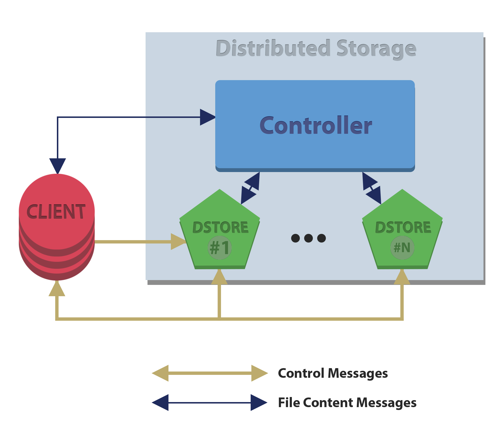

# Java-Based Distributed Storage System



## Overview
This project is a sophisticated implementation of a distributed storage system in Java. It is designed to simulate real-world complexities and challenges in distributed computing, focusing on aspects such as fault tolerance, load balancing, and efficient data management.

## Key Features
- **Modular Design**: Implements a Controller and multiple Data Stores (Dstores) for robust and scalable architecture.
- **Concurrent Operations**: Efficiently handles concurrent client requests for storing, loading, listing, and removing files.
- **Replication and Redundancy**: Implements file replication across Dstores for data integrity and redundancy.
- **Fault Tolerance**: Includes mechanisms to handle Dstore failures and system rebalancing, ensuring continuous operation.
- **Direct Client-Dstore Communication**: Enhances scalability and performance by allowing clients to interact directly with Dstores.

## Technical Implementation
- **Replication Factor (R)**: Each file is replicated 'R' times across different Dstores, enhancing data redundancy and fault tolerance.
- **TCP Networking**: Utilizes TCP connections for reliable communication between Controller, Dstores, and clients.
- **Index Management**: Maintains an index for tracking stored files and their statuses, crucial for managing concurrent operations and system state.
- **Rebalance Operation**: Periodically executes to ensure files are evenly spread across Dstores and replicated correctly, even in the event of Dstore failures or joins.
- **Failure Handling**: Implements strategies to deal with various failure scenarios, ensuring robustness and resilience.

## Broader Context
This system draws inspiration from seminal works in distributed systems, aligning with architectures like Google's GFS and Hadoop's HDFS. It practically applies theoretical concepts of distributed computing, providing a comprehensive understanding of these systems' design and functionality.

## Setup and Usage

### Prerequisites
- Java Development Kit (JDK) installed on your system.
- 
```javac *.java```

### Compiling the Project
1. Navigate to the project directory.
2. Compile the Java files using the Java compiler
3. ```java Controller <controller-port> <R> <timeout> <rebalance-period>```

### Running the System
- **Controller**: Start the Controller first. It will manage the Dstores and handle client requests.
- Replace `<controller-port>`, `<R>`, `<timeout>`, and `<rebalance-period>` with your desired settings.

#

- **Data Stores (Dstores)**: Run multiple instances of Dstores on different machines or on the same machine with different ports.
- ```java Dstore <dstore-port> <dstore-path> <controller-address> <controller-port>```
- Replace `<dstore-port>`, `<dstore-path>`, `<controller-address>`, and `<controller-port>` with appropriate values. 

#

- **Clients**: Clients can connect to the system to perform file operations.
- Use the Controller's address and port to connect.
- ```java Client <controller-address> <controller-port>```

#

### Network Setup
- Ensure all devices are connected to the same network.
- Use valid IP addresses for the Controller and Dstores if running on different machines.

#

### Usage
- Clients interact with the system using commands for storing, loading, listing, and removing files.
- The Controller and Dstores manage these operations behind the scenes, ensuring efficient file distribution and replication.

This setup ensures a scalable and distributed environment, allowing you to test and interact with the system across a network of multiple devices.

---
